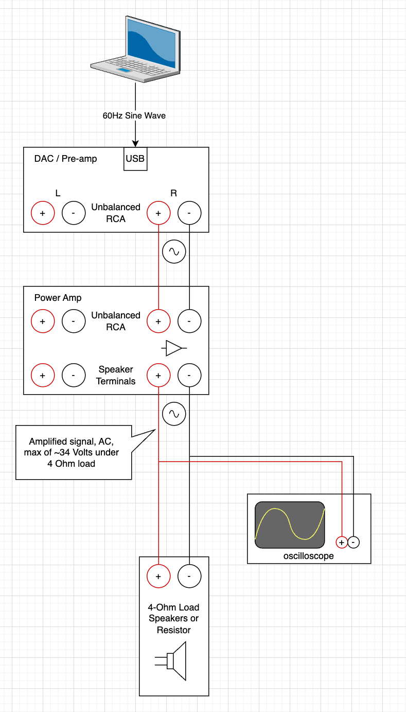
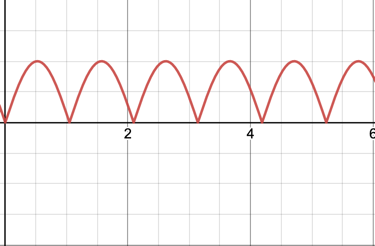
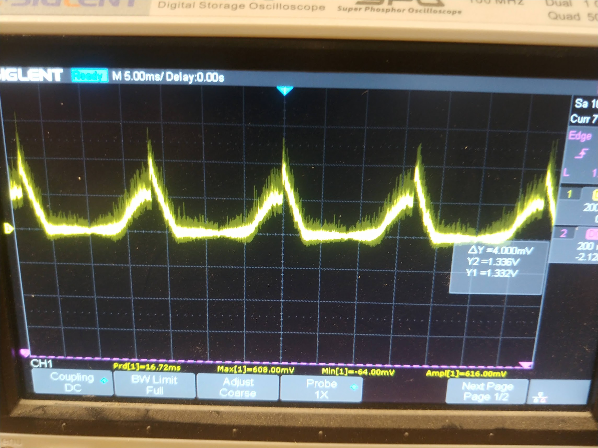

# Troubleshooting VU Meter Design

## Goal

Create a digital VU meter from the amplified speaker-level output of my
Emotiva A-300 power amp. The VU meter should be rendered in real-time,
displaying the power draw peaks based on known speaker impedance and voltage
readings from the amplifier.

## Description

I am using a Raspberry Pi 3B+, combined with an MCP3008 analog-to-digital
converter and some other circuitry to sample the voltage output of the power
amp at a high rate, find maximum peaks, then render a simple bar graph using
a high-refresh plotting library like PyPlot.

## Research Phases

### Understanding true output of power amplifier

I've started off by using a 
[digital multimeter](https://www.kleintools.com/catalog/multimeters/digital-multimeter-auto-ranging-600v) set to Voltage
AC (~) to read a rough RMS value for the power amp. In order to not blow my 4 Ohm
speakers or damage my hearing, I've replaced the speakers on the circuit
with [dummy 4 Ohm, 100W resistors](https://www.amazon.com/uxcell-Aluminum-Wirewound-Replacement-Converter/dp/B07FRYGPFY)
which convert the energy to heat instead of sound. I use a laptop to input a sine wave signal of 60 Hz
to the amp. With the amplifier volume set to 38%, we get a reading of roughly 0.1 to 0.2 Volts RMS.

Here's a diagram of the circuit I have up until this point:

Obviously we don't have the amp turned all the way up so we're not
getting anywhere near 34V. Looking at this under an oscilloscope, we can see a clean sine wave at 60 Hz
with an amplitude of roughly 200 mV:

### Rectifying the signal

All looks good so far. Now comes the tricky part. We want to essentially sample this voltage
using the MCP3008 ADC thousands of times per second, and send the voltage readings to the Raspberry Pi
which is polling for samples in a loop. However, the ADC only reads positive voltage values, i.e. 0 - 3.3V against its
reference voltage, and outputs a value between 0 and 1023 which gets scaled to 0-65k by the Python library. So we can't
input raw AC which has negative current. To remedy this, I've built a simple rectifier circuit
which should, _in theory_, take the negative side of the sine wave and invert it to become positive, something
like this transformation:

to, after rectification,

Because the max voltage amplitude here is only 200 mV, we don't really need worry about adding
a resistor dividing circuit yet to step down the voltage, as this well within the 0-3.3V range
for the ADC. Running the positive and negative leads into a simple rectifier circuit (without the capacitor),
we get some really weird behavior.

Here's my circuit diagram after adding the rectifier circuit:

And a physical view of my breadboard circuit:

However, instead of getting a clean transformation like we should have seen in theory,
I ended up getting this on the oscilloscope:

Over a period of about 20 seconds, the signal gets worse and worse, and slowly devolves:

Why is there so much noise after rectifying the signal? Why does it still drop below 0 Volts? We see readings of min -56 mV.
Is this just what rectifiers do, add noise? Why would the signal go from ~630 mV peaks all the way down to consistently
reading 40 mV peaks?

Steps I've taken to troubleshoot this:
- Make sure no wires are touching or are near each other to pick up EMF noise
- Make sure all connections are solid and secure
- Restarted amplifier, tried 1KHz signals, tried different volume levels
- Tried setting the voltage probe to 10X

All the above didn't really change anything. Still get this crazy amount of noise.
